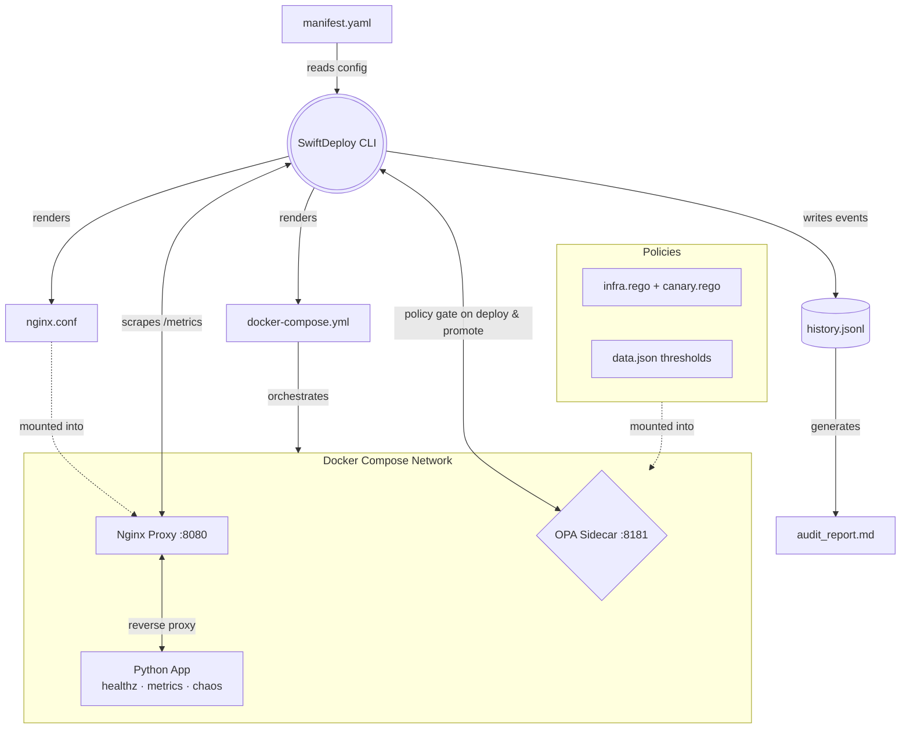

# SwiftDeploy Automation Tool

SwiftDeploy is a declarative, policy-gated infrastructure CLI that manages a full Docker Compose stack. You define your desired state in a single `manifest.yaml` file, and SwiftDeploy generates all configuration files, enforces safety policies via an OPA sidecar before every deployment, and provides real-time observability through a live terminal dashboard and a structured audit trail.

It manages a Python API service, an Nginx reverse proxy, and an Open Policy Agent sidecar — complete with health checks, Prometheus metrics, OPA-gated canary promotions, chaos engineering, and automated compliance reporting.

---

## Prerequisites

- **Docker & Docker Compose** — must be installed and running.
- **Python 3** — required to run the `swiftdeploy` CLI.
- **Linux / macOS / WSL** — expected execution environment.

---

## Setup Instructions

1. **Clone the repository and enter the directory:**
   ```bash
   git clone https://github.com/MichaelAyz/swift-deploy-automation-tool
   cd swift-deploy-automation-tool
   ```

2. **Make the CLI executable:**
   ```bash
   chmod +x swiftdeploy
   ```

3. **Build the Docker image:**
   The manifest expects the app image to be tagged as `swift-deploy-1-node:latest`.
   ```bash
   docker build -t swift-deploy-1-node:latest .
   ```

---

## How It Works

`manifest.yaml` is the **single source of truth**. `swiftdeploy init` reads every field from it and renders `nginx.conf` and `docker-compose.yml` from templates using `{{PLACEHOLDER}}` substitution. Delete the generated files and re-run `./swiftdeploy init` to reproduce them identically.

All external traffic enters through Nginx on port **8080**. The app container is never exposed directly. The OPA sidecar runs on port **8181** and is bound exclusively to `localhost` — it is invisible to Nginx and unreachable from outside the host.

Before a `deploy` or `promote stable`, the CLI queries OPA with live host metrics and blocks the operation if any policy is violated. Every action is logged to `history.jsonl` and can be compiled into `audit_report.md`.

---

## API Endpoints

| Endpoint | Method | Description |
|---|---|---|
| `/` | GET | Service info — mode, version, timestamp |
| `/healthz` | GET | Liveness check — status and uptime |
| `/metrics` | GET | Prometheus-format metrics — requests, latency, uptime, chaos state |
| `/chaos` | POST | Canary mode only — simulate degraded behaviour |

### Chaos modes
```bash
# Slow mode — sleep N seconds before every response
curl -X POST http://localhost:8080/chaos \
  -H "Content-Type: application/json" \
  -d '{"mode":"slow","duration":3}'

# Error mode — return 500 on ~50% of requests
curl -X POST http://localhost:8080/chaos \
  -H "Content-Type: application/json" \
  -d '{"mode":"error","rate":0.5}'

# Recover — clear all chaos state
curl -X POST http://localhost:8080/chaos \
  -H "Content-Type: application/json" \
  -d '{"mode":"recover"}'
```

---

## OPA Policy Enforcement

Policies live in `policies/` and are mounted read-only into the OPA container.

| File | Purpose |
|---|---|
| `policies/infra.rego` | Checks host disk free (GB) and CPU load before deploy |
| `policies/canary.rego` | Checks error rate (%) and P99 latency (ms) before promote stable |
| `policies/data.json` | All threshold values — edit here, not in the Rego files |

To adjust thresholds, edit `policies/data.json`:
```json
{
  "thresholds": {
    "infra": {
      "min_disk_free_gb": 10,
      "max_cpu_load": 2.0
    },
    "canary": {
      "max_error_rate_pct": 1.0,
      "max_p99_latency_ms": 500
    }
  }
}
```

---

## Subcommand Walkthrough

Run `./swiftdeploy <subcommand>` to interact with the tool.

### 1. `init`
**Usage:** `./swiftdeploy init`

Reads `manifest.yaml` and renders `nginx.conf` and `docker-compose.yml` into the project root. Pure file generation — no Docker calls, no side effects.

### 2. `validate`
**Usage:** `./swiftdeploy validate`

Runs pre-flight checks before any deployment:
- `manifest.yaml` exists and is valid YAML.
- All required configuration fields are present.
- The Docker image is built and available locally.
- The Nginx port is free on the host.
- The generated `nginx.conf` contains required directives and has balanced braces.

### 3. `deploy`
**Usage:** `./swiftdeploy deploy`

Policy-gated full deployment lifecycle:
1. Generates `nginx.conf` and `docker-compose.yml` from the manifest.
2. Starts the OPA sidecar and queries the **infra policy** with live host disk and CPU stats. Aborts with a clear violation message if denied.
3. Brings up the full stack (`app`, `nginx`, `opa`) with Docker Compose.
4. Polls `/healthz` through Nginx until healthy or 60-second timeout.
5. Records the deployment event to `history.jsonl`.

### 4. `promote`
**Usage:** `./swiftdeploy promote [canary | stable]`

Safely switches the deployment mode:
- When promoting **canary → stable**: scrapes live `/metrics`, calculates the real-time error rate and P99 latency, and queries the **canary policy**. Blocks if the canary is unhealthy.
- Updates the `mode` field in `manifest.yaml` in-place.
- Regenerates `docker-compose.yml` and restarts **only** the app container (Nginx and OPA stay running).
- Verifies the new mode is active via `/healthz` and `/`.
- Records the promotion and policy check events to `history.jsonl`.

*Canary mode injects `X-Mode: canary` into response headers and unlocks the `/chaos` endpoint.*

### 5. `teardown`
**Usage:** `./swiftdeploy teardown [--clean]`

Stops the stack and removes all containers, networks, and volumes. The `--clean` flag also deletes the generated `nginx.conf` and `docker-compose.yml`.

### 6. `status`
**Usage:** `./swiftdeploy status`

Live-refreshing terminal dashboard. Scrapes `/metrics` every 5 seconds and displays:
- Current mode, uptime, and chaos state.
- Real-time throughput (req/s), error rate (%), and P99 latency (ms).
- Live OPA policy compliance for both `infra` and `canary` policies.
- Violations printed inline when a policy check fails.

Every scrape is appended to `history.jsonl`.

```
┌─ SwiftDeploy Status — 2026-05-06T16:02:02Z (scrape #2)
│  Mode: stable      Uptime: 32s  Chaos: none
│  Throughput: 0.2 req/s  Errors: 0.0%  P99: 4.95ms
│
│  Policy Compliance:
│    [✓] infra   — all infrastructure checks passed
│    [✓] canary  — canary health checks passed
└─────────────────────────────────────────────────────
```

Press `Ctrl+C` to stop.

### 7. `audit`
**Usage:** `./swiftdeploy audit`

Parses `history.jsonl` and generates `audit_report.md` — a GitHub Flavored Markdown report containing:
- **Timeline** — all deploy, promote, and chaos events with timestamps.
- **Policy Violations** — every OPA denial recorded during status scrapes or promote checks.
- **Summary** — total event count and violation count.

---

## Architecture


